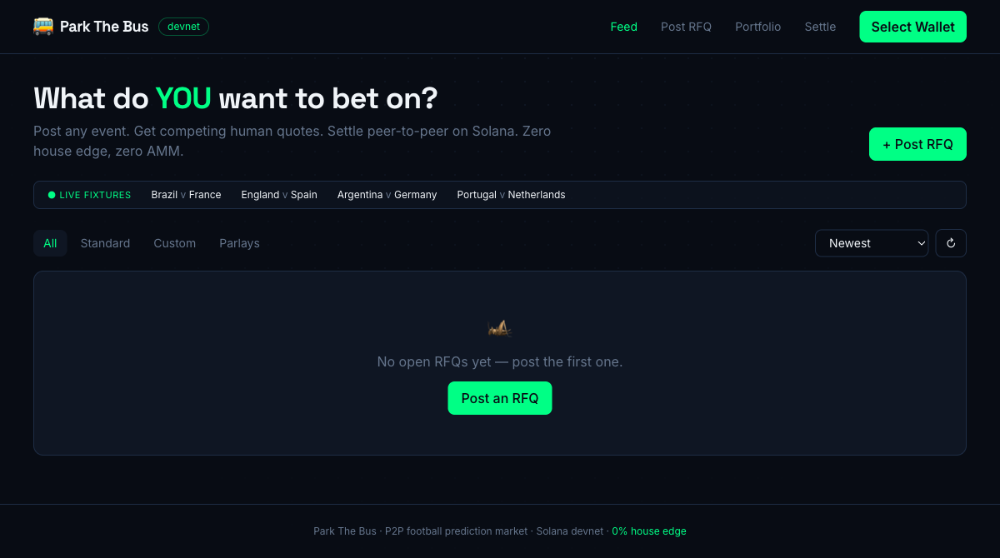
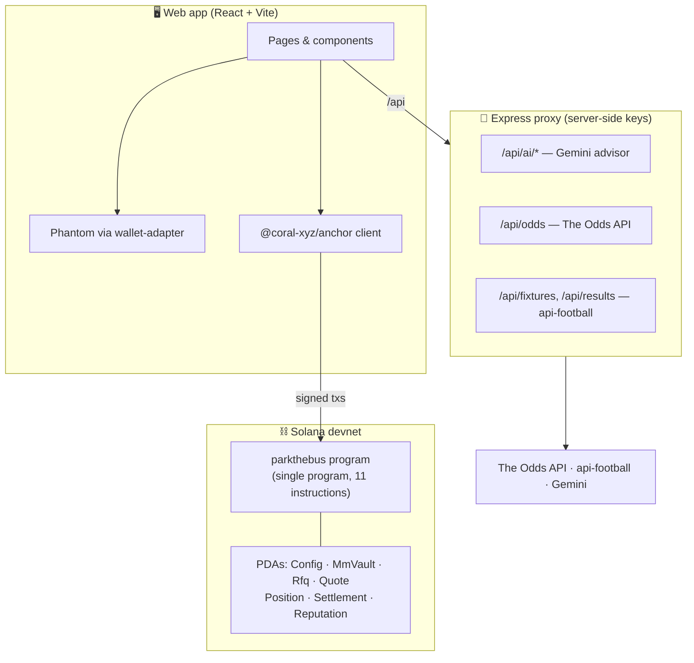

# Park The Bus 🚌

**A peer-to-peer football prediction market on Solana — "What do *you* want to bet on?"**


Park The Bus is a fully peer-to-peer prediction market. Bettors post a **Request for Quote (RFQ)** for *any* event — a match result, a scorer, or something custom like _"Ronaldo to cry"_ — along with the odds and stake they want. Market makers compete to quote the best odds. The best quote wins, funds escrow in an on-chain program, and a transparent on-chain council settles the outcome. Reputation updates on-chain after every market.

**Zero house edge. Zero AMM. Real humans quoting real odds.**

> **Status:** Hackathon MVP, **live on Solana devnet**. The `parkthebus` program is deployed and initialized, the web app runs against it with real on-chain RFQs in the feed, and the contract is covered by 26 LiteSVM tests (see [Project status](#project-status)).

---

## Table of contents

- [Why it exists](#why-it-exists)
- [How it works](#how-it-works)
- [Architecture](#architecture)
- [The on-chain program](#the-on-chain-program)
- [Manipulation prevention](#manipulation-prevention)
- [Tech stack](#tech-stack)
- [Repository layout](#repository-layout)
- [Getting started](#getting-started)
- [Environment variables](#environment-variables)
- [Project status](#project-status)
- [Roadmap](#roadmap)
- [Disclaimer](#disclaimer)

---

## Why it exists

Existing platforms each leave the same gap:

| | Park The Bus | Polymarket | Betfair | Sportybet |
|---|:---:|:---:|:---:|:---:|
| Custom events ("Ronaldo cries") | ✅ | ❌ | ❌ | ❌ |
| User-quoted odds | ✅ | ❌ (AMM) | Partial | ❌ |
| P2P, no house | ✅ | Partial | ✅ | ❌ |
| Parlays | ✅ | ❌ | ❌ | ✅ |
| On-chain manipulation prevention | ✅ | Partial | ❌ | ❌ |
| Open market creation | ✅ | ❌ (governance) | ❌ | ❌ |
| House commission | **0%** | ~2% spread | 5% | Baked into odds |

**The differentiator:** custom-event RFQs + competitive P2P odds negotiation + on-chain manipulation prevention, fully on Solana.

**Why Solana specifically:** the core mechanic is *competitive quoting* — market makers post many quotes, most of which never match. That's only rational where posting a quote costs a fraction of a cent. A single market is ~15–20 transactions (1 RFQ + ~10 quotes + accept + council votes + settlement); on Solana that's ~$0.01, on an EVM L1 it's ~$32. This is exactly why Polymarket runs its order matching off-chain — and why Park The Bus can stay fully on-chain and verifiable.

---

## How it works

```
  Bettor                 Market Makers              Council              Chain
    │                          │                       │                   │
    │  post_rfq (event, odds,  │                       │                   │
    │  stake, 0.01 SOL deposit)│                       │       RFQ PDA ────▶│
    │─────────────────────────────────────────────────────────────────────│
    │                          │  submit_quote (free)  │                   │
    │                          │──────────────────────────▶ Quote PDAs ───▶│
    │  accept_quote (best)     │                       │                   │
    │─────────────────────────────────────────────────▶ stake + MM        │
    │                          │                       │  collateral escrow │
    │                          │                       │   in Position PDA  │
    │                          │      match plays out   │                   │
    │                          │       sign_settlement  │                   │
    │                          │◀──────────────────────│ (threshold votes) │
    │                          │   execute_settlement   │                   │
    │◀─────────────── payout / refund per outcome ──────────────────────────│
    │                          │      reputation updated on-chain          │
```

1. **Bettor posts an RFQ** — picks a match (or types a custom event), sets stake, minimum odds, and expiry. A refundable **0.01 SOL** spam-prevention deposit is locked. Custom events go to the council for approval; standard events are auto-approved.
2. **Market makers quote** — they browse the open RFQ feed and submit competing quotes. Quotes are **free** (no SOL locked) — only the winning quote ever pulls collateral.
3. **Bettor accepts the best quote** — this atomically escrows the bettor's stake and pulls the MM's collateral into a per-position PDA. Collateral = `stake × (odds − 1)`, i.e. exactly the bettor's potential winnings.
4. **The council settles** — after the match, council members vote on the outcome (`BettorWins` / `MmWins` / `Void`). Once the vote threshold is met, anyone can call `execute_settlement` to release the escrow.
5. **Reputation updates on-chain** — win/loss, volume, and dispute history are recorded per wallet, readable by anyone.

**Parlays** are supported as all-or-nothing units: one MM quotes the whole parlay, each leg's result is recorded on-chain, and any losing leg settles the whole position to the MM.

An **AI advisor** (Google Gemini, server-side only) gives the bettor pricing guidance, gives the MM an EV/break-even read on their quote, and produces a plain-English summary of any position before signing.



---

## Architecture



- **Frontend** talks to the chain directly through the wallet + Anchor client. No backend sits between the user and their funds — signing happens in Phantom.
- **The Express proxy** exists only to keep third-party API keys server-side (Gemini, odds, fixtures). It never touches funds. If the proxy is unavailable, the app degrades gracefully — fixtures fall back to a bundled World Cup schedule and the AI advisor falls back to templated guidance.
- **Escrow is native SOL** held as lamports in system-owned PDAs (one per position). There is no SPL token account in the MVP; the USDC-on-mainnet switch is isolated to the escrow module.

---

## The on-chain program

A single Anchor program, `parkthebus`, with `rfq` / `settlement` / `reputation` modules. (The 3-program CPI split is a documented post-MVP refactor — a working single-program loop demos better than a broken three-program one.)

- **Program ID:** `6xzNc5rA9bMi8DzH1ZMp1CKrnC51XvurYTX5ygaGqm2i`
- **11 instructions · 7 account types · native-SOL escrow**

### Instructions

| Instruction | Caller | What it does |
|---|---|---|
| `initialize` | Authority | Registers the council + vote threshold and the RFQ counter |
| `deposit_collateral` | Market maker | Tops up the MM's collateral vault (quotes stay free) |
| `post_rfq` | Bettor | Creates the RFQ PDA and locks the 0.01 SOL deposit |
| `submit_quote` | Market maker | Creates a free competing Quote PDA (no SOL locked) |
| `accept_quote` | Bettor | Escrows stake + pulls MM collateral, opens a Position |
| `approve_market` | Council | Approves/rejects a custom-event RFQ awaiting review |
| `cancel_rfq` | Bettor | Cancels an unmatched RFQ (refunds deposit + rent) |
| `expire_rfq` | Anyone | Permissionless crank: cleans up an expired, unmatched RFQ |
| `sign_settlement` | Council | Votes on a matched position's outcome (threshold-gated) |
| `record_leg_result` | Council | Records one parlay leg's Won/Lost result |
| `execute_settlement` | Anyone | Releases escrow once the vote threshold is met |

### Accounts (PDAs)

`Config` (council + threshold + RFQ counter) · `MmVault` (MM collateral) · `RfqAccount` · `QuoteAccount` · `PositionAccount` (escrow + matched odds) · `SettlementAccount` (votes + outcome) · `ReputationAccount` (per-wallet history).

### Collateral & payout

```
Bettor stakes X SOL at odds Y
  Payout if correct  = X × Y
  MM locks           = X × (Y − 1)   ← exactly the bettor's potential winnings

Example: 0.5 SOL at 2.4x → payout 1.2 SOL, MM locks 0.7 SOL
```

Settlement outcomes: **BettorWins** (bettor takes payout), **MmWins** (MM takes stake + own collateral back), **Void** (match postponed/abandoned → both parties refunded). Funds are conserved in all three paths — verified by the test suite.

---

## Manipulation prevention

Enforced on-chain, not by policy:

- **Spam deposit** — every RFQ locks 0.01 SOL, refunded on clean settlement. Kills junk markets.
- **Council auto-exclusion** — a council member with an active position in a market cannot vote on its settlement.
- **No double-voting** — a council pubkey can appear at most once in a settlement's votes; duplicate council keys are rejected at `initialize`.
- **Threshold settlement** — funds release only at the configured vote threshold (`size / 2 + 1`). No single admin can settle alone. Devnet runs a 2-of-2 council, scalable to N-of-M via the on-chain `Config` (no code rewrite).
- **Kickoff / expiry guards** — clock-checked on-chain: no accepting after expiry, no quoting after kickoff.
- **Fail-closed** — if the council can't reach consensus, funds stay safely escrowed rather than being released incorrectly.

---

## Tech stack

| Layer | Choice |
|---|---|
| Smart contract | Anchor 1.0 (Agave 3.x, Rust) — single `parkthebus` program |
| Program tests | LiteSVM (Rust, `cargo test`) — 26 tests |
| Frontend | React 19 + Vite + TypeScript + Tailwind CSS |
| Wallet | `@solana/wallet-adapter` (Phantom) |
| Chain client | `@coral-xyz/anchor` + `@solana/web3.js` |
| Proxy server | Express (TypeScript) |
| AI | Google Gemini (`gemini-2.5-flash`), server-side only |
| Market data | The Odds API + api-football (with mock fallback) |
| Network | Solana devnet (native SOL; USDC-ready for mainnet) |

---

## Repository layout

```
ParkTheBus/
├── programs/parkthebus/      # Anchor program
│   ├── src/
│   │   ├── lib.rs            # program entrypoints (11 instructions)
│   │   ├── instructions/     # one file per instruction
│   │   ├── state.rs          # 7 account types
│   │   ├── constants.rs · error.rs · util.rs
│   └── tests/                # LiteSVM Rust tests (rfq / settlement / parlay)
├── app/
│   ├── src/
│   │   ├── pages/            # Home, NewRFQ, RFQDetail, Portfolio,
│   │   │                     #   MarketMaker, AdminSettle, Reputation
│   │   ├── components/       # RFQ card, quote list, parlay builder, AI advisor…
│   │   ├── hooks/            # useActions (txs), useData (account fetches)
│   │   ├── lib/              # anchor client, PDAs, api proxy client, formatters
│   │   ├── idl/              # program IDL + types
│   │   └── config.ts         # RPC, program id, council, constants
│   └── server/               # Express proxy (Gemini + odds + fixtures)
├── docs/PRD.md               # full product requirements (v2.0)
├── Anchor.toml · Cargo.toml
└── README.md
```

---

## Getting started

### Prerequisites

- Node.js ≥ 18
- Rust + the Solana/Anchor toolchain (only needed to build/deploy the program) — `curl -fsSL https://www.solana.new/setup.sh | bash`

### 1 · Run the web app

```bash
cd app
npm install
npm run dev          # http://localhost:5173
```

The app reads its config from `app/src/config.ts` (sensible defaults baked in). To point at a custom RPC or program, copy `app/.env.local` and edit:

```env
VITE_SOLANA_RPC=https://devnet.helius-rpc.com/?api-key=YOUR_KEY
VITE_PROGRAM_ID=6xzNc5rA9bMi8DzH1ZMp1CKrnC51XvurYTX5ygaGqm2i
VITE_API_BASE=/api
```

A free dedicated devnet RPC (Helius/QuickNode/Alchemy) is recommended — the public endpoint rate-limits `getProgramAccounts`.

### 2 · Run the proxy server (optional)

The app works without it (bundled fixtures + templated AI), but the proxy lights up live odds, fixtures, and the Gemini advisor.

```bash
cd app/server
npm install
cp .env.example .env   # fill in keys (all optional)
npm run dev            # http://localhost:8787, vite proxies /api → here
```

### 3 · Build, test & deploy the program

```bash
anchor build
cargo test                                    # 26 LiteSVM tests
anchor deploy --provider.cluster devnet       # needs a funded deploy wallet
```

After deploying, run `initialize` with the council pubkeys + threshold, then seed a few demo RFQs.

---

## Environment variables

**Frontend** (`app/.env.local`, all optional — defaults in `config.ts`): `VITE_SOLANA_RPC`, `VITE_PROGRAM_ID`, `VITE_API_BASE`.

**Server** (`app/server/.env`, all optional — graceful fallback without them):

| Var | Purpose | Free tier |
|---|---|---|
| `GEMINI_API_KEY` | AI advisor / MM assistant / contract summary | [aistudio.google.com/apikey](https://aistudio.google.com/apikey) |
| `ODDS_API_KEY` | Live implied odds | [the-odds-api.com](https://the-odds-api.com) — 500 req/mo |
| `FOOTBALL_API_KEY` | Fixtures & results | [api-football.com](https://www.api-football.com) — 100 req/day |
| `PORT` | Proxy port (default 8787) | — |

API keys are **only ever used server-side** and never reach the browser.

---

## Project status

Park The Bus is a hackathon MVP. Honest snapshot:

- ✅ **On-chain program** — deployed to **devnet** under the program ID above and initialized with the council Config. 11 instructions, 7 account types, audited across three review passes, **26 LiteSVM tests passing**. Funds proven conserved across all settlement outcomes; no path lets a single party force a payout.
- ✅ **Web app** — all 7 pages and the full RFQ → quote → accept → settle flow are built; the feed reads live RFQ accounts straight from the chain, and the AI advisor is wired end-to-end (frontend → proxy → Gemini) with mock fallback.
- ✅ **Live demo data** — the devnet feed is seeded with open RFQs (standard, custom, and a parlay) so the market isn't empty.

Remaining for production: mainnet deployment behind a security audit, USDC settlement, and scaling the council (see [Roadmap](#roadmap)).

---

## Roadmap

1. **Now** — FIFA World Cup 2026, Solana devnet, native SOL.
2. **Mainnet** — security audit, USDC settlement (architecture already isolated).
3. **Any sport** — NBA, cricket, F1.
4. **Any event** — elections, awards, crypto prices.
5. **Settlement layer as public infrastructure** — other apps read the reputation/settlement layer via CPI.
6. **DAO governance** — community-owned council, appeal layer, `$PTB`.

*The real product is the settlement layer. Betting is just the first use case.*

---

## Disclaimer

This is experimental, unaudited-for-production software built for a hackathon and running on **devnet** with **test SOL**. Do not use with real funds. Prediction markets and betting may be regulated in your jurisdiction — this project is for educational and demonstration purposes only.

See [`docs/PRD.md`](docs/PRD.md) for the full product specification.
